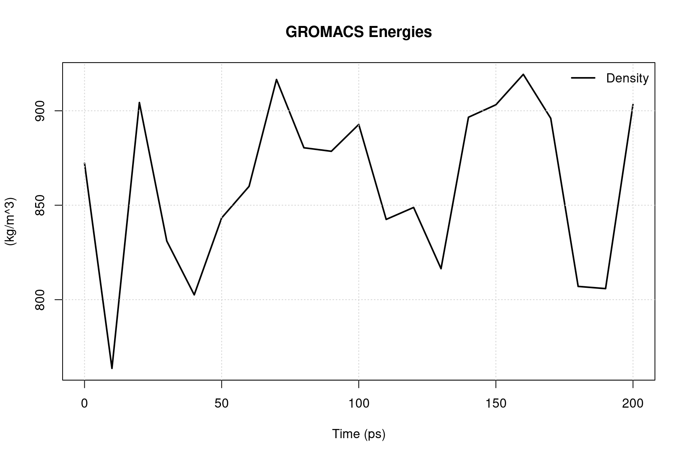
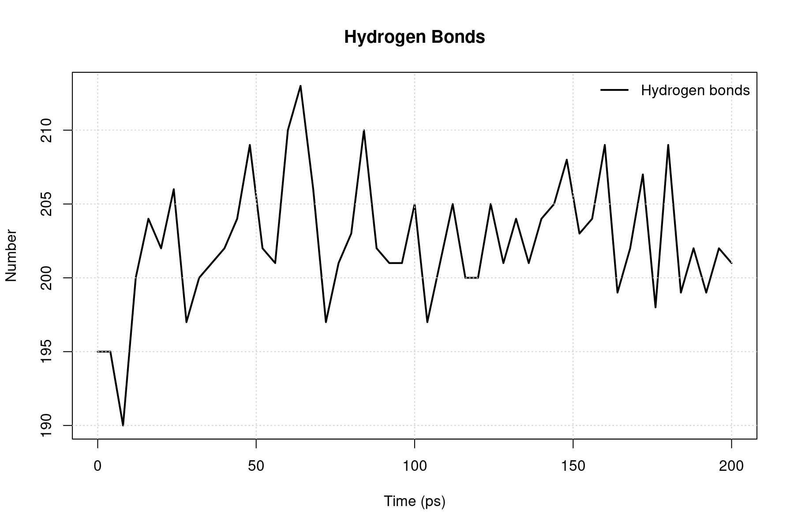
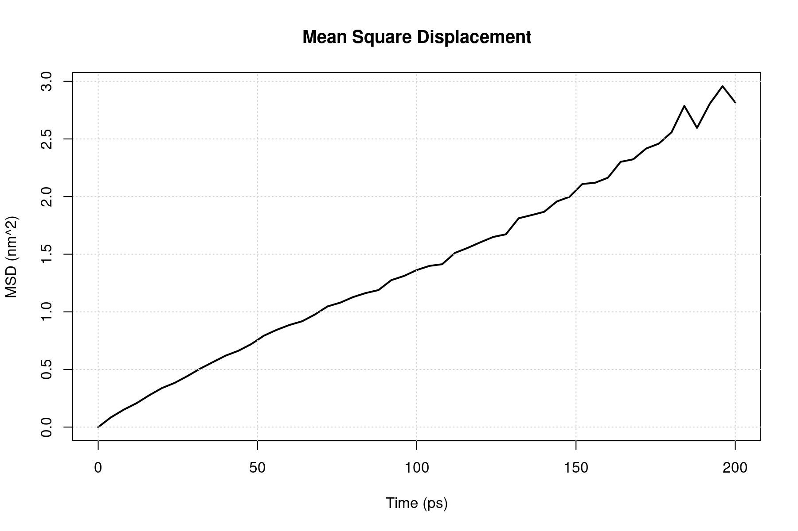
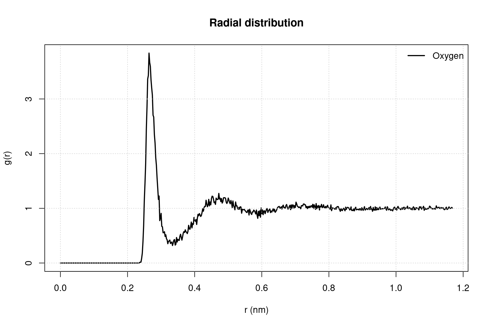

# Molecular Dynamics Simulation of Liquid Methanol

This directory contains a short molecular dynamics workflow for a periodic box of liquid methanol simulated with GROMACS.

## System and simulation setup

- **216 methanol molecules**
- **648 interaction sites**
- **GROMOS96 43A1 force field**
- Three-site united-atom methanol model:
  - `Me1` — united-atom methyl group
  - `O2` — hydroxyl oxygen
  - `H3` — hydroxyl hydrogen
- **Cubic box:** 2.36191 × 2.36191 × 2.36191 nm
- **Temperature:** 298.15 K
- **Pressure:** 1 bar
- **Time step:** 2 fs
- **Number of steps:** 100,000
- **Total simulation time:** 200 ps
- **Thermostat:** Nose–Hoover
- **Barostat:** Parrinello–Rahman
- **Pressure-coupling time constant:** 4 ps
- **Electrostatics:** Particle Mesh Ewald
- **Bond constraints:** LINCS for bonds involving hydrogen

## Short workflow

1. The methanol structure, topology and MD parameters were prepared in the `.gro`, `.top`, `.itp` and `.mdp` files.
2. The run input file was generated with `gmx grompp`.
3. A 200 ps NPT molecular dynamics simulation was performed with `gmx mdrun`.
4. The trajectory was inspected in VMD.
5. The following properties were calculated with GROMACS:
   - oxygen–oxygen radial distribution function,
   - hydrogen-bond count,
   - oxygen mean square displacement,
   - diffusion coefficient,
   - density.
6. GROMACS `.xvg` files were converted into PNG plots using an R script.

Example execution:

```bash
gmx grompp \
  -f methanol_grompp.mdp \
  -c methanol_conf.gro \
  -p methanol_topol.top \
  -o methanol.tpr

gmx mdrun -s methanol.tpr -deffnm methanol -v

Rscript plot_all_xvg.R
```

## Results

### Density

The average density reported by GROMACS was:

```text
858.715 ± 7.1 kg/m³
```

The instantaneous density fluctuated approximately between 765 and 920 kg/m³. The system remained in a condensed liquid state, although the relatively large fluctuations and the reported total drift of about 28.2 kg/m³ indicate that the 200 ps trajectory provides only a preliminary density estimate.



### Hydrogen bonds

The average number of hydrogen bonds was:

```text
202.392 hydrogen bonds per frame
```

For 216 methanol molecules, this corresponds to approximately:

```text
1.87 hydrogen-bond connections per molecule
```

The hydrogen-bond count fluctuated mainly between approximately 190 and 213 without a clear long-term increase or decrease, indicating a persistent but dynamically reorganizing hydrogen-bond network.



### Mean square displacement and diffusion

The oxygen mean square displacement increased approximately linearly with time, reaching about 2.8 nm² after 200 ps. This indicates normal translational diffusion of methanol molecules in the liquid phase.

The diffusion coefficient reported by GROMACS was:

```text
D = 2.2089 × 10⁻⁵ cm²/s
  = 2.2089 × 10⁻⁹ m²/s
```

with an estimated uncertainty of:

```text
± 0.3325 × 10⁻⁵ cm²/s
```

The linear fit was performed between 20 and 180 ps.



### Oxygen–oxygen radial distribution function

The oxygen–oxygen RDF showed:

```text
first maximum: r ≈ 0.26–0.27 nm, g(r) ≈ 3.8
first minimum: r ≈ 0.33–0.35 nm
second broad maximum: r ≈ 0.46–0.48 nm
```

The strong first peak represents the first coordination shell of hydroxyl oxygen atoms and reflects short-range organization caused mainly by hydrogen bonding. At larger distances, `g(r)` approached 1, indicating the absence of long-range positional order, as expected for a liquid.



## Main conclusions

The 200 ps simulation preserved liquid methanol with a dynamic hydrogen-bond network and normal diffusive motion. The oxygen–oxygen RDF showed pronounced short-range ordering, while the MSD increased nearly linearly. The density remained within a condensed-liquid range but showed substantial fluctuations, so longer equilibration and production runs would be required for a more precise quantitative comparison with reference data.range ordering, while the MSD increased nearly linearly. The density remained within a condensed-liquid range but showed substantial fluctuations, so longer equilibration and production runs would be required for a more precise quantitative comparison with reference data.
